# Snowflake Lakehouse

&nbsp;&nbsp;&nbsp;&nbsp;&nbsp;&nbsp;&nbsp;&nbsp;

A Snowflake Lakehouse implementation with AWS and Infrastructure as Code (Terraform), automated deployment using GitHub Actions.

## Overview

This repository tracks the build of an end-to-end Snowflake data engineering solution—from source data analysis and ingestion design to layered stage/raw/curated modeling, automation with DAG + GitHub Actions, dynamic tables, and Streamlit dashboards—using Snowpark Python and marketplace datasets.

The project demonstrates a complete data lakehouse implementation with:

- **Infrastructure as Code**: Terraform configurations for AWS (S3, IAM) and Snowflake resources
- **Layered Data Architecture**: Stage → Raw → Curated data modeling pattern
- **Automated Ingestion**: Snowpipe for real-time data loading from S3
- **Data Transformation**: Snowpark Python for ETL/ELT processing
- **Orchestration**: DAG-based workflows with GitHub Actions CI/CD
- **Dynamic Tables**: Incremental data processing with automatic refresh
- **Visualization**: Streamlit dashboards for data exploration
- **Marketplace Integration**: Leveraging Snowflake marketplace datasets

## Repository Structure

```
.
├── infra/                              # Infrastructure as Code
│   └── platform/tf/                    # Root Terraform orchestration (entry point)
│       ├── main.tf                     # Resource orchestration (modules)
│       ├── locals.tf                   # Configuration parsing from JSON
│       ├── variables.tf                # Input variables
│       ├── outputs.tf                  # Module outputs
│       ├── versions.tf                 # Terraform & provider versions
│       ├── backend.tf                  # Terraform backend configuration
│       ├── providers-aws.tf            # AWS provider configuration
│       ├── providers-snowflake.tf      # Snowflake provider with role aliases
│       ├── terraform.tfvars            # Variable values
│       ├── modules/                    # Local modules
│       │   ├── iam_role_final/         # IAM role trust policy update
│       │   └── iam_trust_policy/       # IAM trust policy configuration
│       └── templates/                  # Template files
│           ├── bucket-policy/          # S3 bucket policy templates
│           ├── dynamic-tables/         # Dynamic table templates
│           └── snowpipe-copy-statements/ # Snowpipe COPY statement templates
├── input-jsons/                        # Configuration files
│   ├── aws/config.json                 # AWS resource configuration
│   └── snowflake/config.json           # Snowflake resource configuration
├── .github/
│   └── workflows/                      # GitHub Actions CI/CD
│       ├── ci.yaml                     # Continuous integration
│       ├── terraform-deploy.yaml       # Terraform deployment
│       └── terraform-destroy.yaml      # Terraform destroy
├── .devcontainer/                      # Dev container configuration
├── cliff.toml                          # git-cliff changelog configuration
└── README.md
```

## Architecture

This project implements a **multi-phase deployment architecture** that orchestrates AWS and Snowflake resources with proper dependency management.

### High-Level Data Flow

```mermaid
flowchart LR
    subgraph Sources["DATA SOURCES"]
        direction TB
        S1[CSV Files]
        S2[JSON Files]
        S3[Parquet Files]
    end

    subgraph AWS["AWS"]
        S3Bucket["S3 BUCKET<br/>Landing zone with<br/>event notifications"]
    end

    subgraph Snowflake["SNOWFLAKE"]
        direction TB
        SI["STORAGE INTEGRATION<br/>Cross-cloud auth"]
        ES["EXTERNAL STAGES<br/>S3 references"]
        SP["SNOWPIPES<br/>Auto-ingest"]
    end

    subgraph Layers["DATA LAYERS"]
        direction TB
        STG["STAGING<br/>Raw landing"]
        RAW["RAW<br/>Cleansed data"]
        CUR["CURATED<br/>Business-ready"]
    end

    subgraph Consumption["CONSUMPTION"]
        direction TB
        ST[Streamlit]
        BI[BI Tools]
        DS[Data Sharing]
    end

    Sources --> S3Bucket
    S3Bucket --> SI
    SI --> ES
    ES --> SP
    SP --> STG
    STG --> RAW
    RAW --> CUR
    CUR --> Consumption
```



### Deployment Phases

| Phase | Description | Resources Created |
|-------|-------------|-------------------|
| **Phase 1** | AWS Resources | S3 Bucket, IAM Role (placeholder trust policy) |
| **Phase 2** | Snowflake Resources | Warehouses, Databases, Schemas, Storage Integration, External Stages, Tables, Snowpipes |
| **Phase 3** | AWS Trust Policy Update | Update IAM Role trust policy with Snowflake's IAM User ARN and External ID |
| **Phase 4** | S3 Event Notifications | Configure S3 bucket notifications to trigger Snowpipe auto-ingest |

## Security & Governance

### Role-Based Access Control (RBAC)

This project implements a **least-privilege governance model** using dedicated admin roles for different Snowflake object types. Each role has specific permissions to create and manage only the objects within its domain, following Snowflake's recommended security best practices.

#### Admin Roles Overview

| Role | Purpose | Objects Managed | Provider Alias |
|------|---------|-----------------|----------------|
| `WAREHOUSE_ADMIN` | Warehouse lifecycle management | Warehouses | `snowflake.warehouse_provisioner` |
| `PLATFORM_DB_OWNER` | Database & schema administration | Databases, Schemas | `snowflake.db_provisioner` |
| `DATA_OBJECT_ADMIN` | Data object administration | File Formats, Tables | `snowflake.data_object_provisioner` |
| `INGEST_ADMIN` | Ingestion pipeline administration | Storage Integrations, Stages, Snowpipes | `snowflake.ingest_object_provisioner` |

#### Role Hierarchy & Responsibilities

```
                                    ACCOUNTADMIN
                                         │
                          ┌──────────────┼──────────────┐
                          │              │              │
                          ▼              ▼              ▼
                     SYSADMIN      SECURITYADMIN    USERADMIN
                          │
      ┌───────────────────┼───────────────────┬───────────────────┐
      │                   │                   │                   │
      ▼                   ▼                   ▼                   ▼
WAREHOUSE_ADMIN    PLATFORM_DB_OWNER   DATA_OBJECT_ADMIN    INGEST_ADMIN
      │                   │                   │                   │
      ▼                   ▼                   ▼                   ▼
 Warehouses          Databases          File Formats     Storage Integrations
                     Schemas            Tables           Stages
                                                         Snowpipes
```

#### Benefits of Role Separation

| Benefit | Description |
|---------|-------------|
| **Least Privilege** | Each role only has permissions for its specific domain |
| **Audit Trail** | Clear ownership and accountability for each object type |
| **Separation of Duties** | Different teams can manage different object types |
| **Blast Radius Reduction** | Compromised credentials have limited impact |
| **Compliance Ready** | Easier to demonstrate access controls for SOC2, HIPAA, etc. |
| **Operational Safety** | Prevents accidental modifications to unrelated objects |

#### Required Privileges by Object Type

The following table details the privileges required for each Snowflake object type to enable Snowpipe and Dynamic Tables to work seamlessly.

| Object Type | Privilege | Role | Purpose |
|-------------|-----------|------|---------|
| **Warehouse** | `CREATE WAREHOUSE` | `WAREHOUSE_ADMIN` | Create warehouses |
| | `USAGE` | `INGEST_ADMIN`, `DATA_OBJECT_ADMIN` | Execute queries for pipes/transformations |
| | `OPERATE` | `INGEST_ADMIN` | Resume/suspend warehouse for pipe operations |
| | `MONITOR` | `WAREHOUSE_ADMIN` | Monitor warehouse usage |
| **Database** | `CREATE DATABASE` | `PLATFORM_DB_OWNER` | Create databases |
| | `USAGE` | `DATA_OBJECT_ADMIN`, `INGEST_ADMIN` | Access database objects |
| **Schema** | `CREATE SCHEMA` | `PLATFORM_DB_OWNER` | Create schemas within database |
| | `USAGE` | `DATA_OBJECT_ADMIN`, `INGEST_ADMIN` | Access schema objects |
| | `CREATE FILE FORMAT` | `DATA_OBJECT_ADMIN` | Create file formats in schema |
| | `CREATE TABLE` | `DATA_OBJECT_ADMIN` | Create tables in schema |
| | `CREATE STAGE` | `INGEST_ADMIN` | Create stages in schema |
| | `CREATE PIPE` | `INGEST_ADMIN` | Create snowpipes in schema |
| | `CREATE DYNAMIC TABLE` | `DATA_OBJECT_ADMIN` | Create dynamic tables in schema |
| **Table** | `INSERT` | `INGEST_ADMIN` | Snowpipe inserts data into tables |
| | `SELECT` | `INGEST_ADMIN`, `DATA_OBJECT_ADMIN` | Read data for validation/transformation |
| | `OWNERSHIP` | `DATA_OBJECT_ADMIN` | Full control over table |
| **File Format** | `USAGE` | `INGEST_ADMIN` | Use file format in COPY/pipe operations |
| | `OWNERSHIP` | `DATA_OBJECT_ADMIN` | Full control over file format |
| **Stage (External)** | `USAGE` | `INGEST_ADMIN` | Access stage for COPY operations |
| | `READ` | `INGEST_ADMIN`, `DATA_OBJECT_ADMIN` | Read files from external stage |
| | `OWNERSHIP` | `INGEST_ADMIN` | Full control over stage |
| **Stage (Internal)** | `READ`, `WRITE` | `INGEST_ADMIN`, `DATA_OBJECT_ADMIN` | Read/write files to internal stage |
| **Storage Integration** | `CREATE INTEGRATION` | `INGEST_ADMIN` | Create storage integrations (account-level) |
| | `USAGE` | `INGEST_ADMIN`, `DATA_OBJECT_ADMIN` | Use integration in stages |
| **Pipe (Snowpipe)** | `OWNERSHIP` | `INGEST_ADMIN` | Full control over pipe |
| | `OPERATE` | `INGEST_ADMIN` | Pause/resume pipe |
| | `MONITOR` | `INGEST_ADMIN` | View pipe status/history |
| **Dynamic Table** | `CREATE DYNAMIC TABLE` | `DATA_OBJECT_ADMIN` | Create dynamic tables |
| | `SELECT` | `DATA_OBJECT_ADMIN` | Query dynamic table |
| | `OPERATE` | `DATA_OBJECT_ADMIN` | Manually refresh dynamic table |
| | `OWNERSHIP` | `DATA_OBJECT_ADMIN` | Full control over dynamic table |
| **Stream** | `CREATE STREAM` | `DATA_OBJECT_ADMIN` | Create streams on tables |
| | `SELECT` | `DATA_OBJECT_ADMIN` | Read stream changes |
| | `OWNERSHIP` | `DATA_OBJECT_ADMIN` | Full control over stream |
| **Task** | `CREATE TASK` | `DATA_OBJECT_ADMIN` | Create scheduled tasks |
| | `EXECUTE TASK` | `DATA_OBJECT_ADMIN` | Run tasks |
| | `OPERATE` | `DATA_OBJECT_ADMIN` | Resume/suspend tasks |
| | `OWNERSHIP` | `DATA_OBJECT_ADMIN` | Full control over task |

#### How Role Separation Works

1. **Terraform Provider Aliases**: Each admin role has a dedicated Snowflake provider alias configured in `providers-snowflake.tf`:

```hcl
# Warehouse operations
provider "snowflake" {
  alias = "warehouse_provisioner"
  role  = var.warehouse_provisioner_role  # WAREHOUSE_ADMIN
}

# Database/Schema operations
provider "snowflake" {
  alias = "db_provisioner"
  role  = var.db_provisioner_role  # PLATFORM_DB_OWNER
}

# File Format/Table operations
provider "snowflake" {
  alias = "data_object_provisioner"
  role  = var.data_object_provisioner_role  # DATA_OBJECT_ADMIN
}

# Storage Integration/Stage/Pipe operations
provider "snowflake" {
  alias = "ingest_object_provisioner"
  role  = var.ingest_object_provisioner_role  # INGEST_ADMIN
}
```

2. **Module Provider Assignment**: Each Terraform module uses the appropriate provider based on the objects it manages.

3. **Cross-Role Grants**: When objects created by one role need to be accessed by another role, explicit grants are configured.

## Configuration

### JSON Configuration Files

All resources are defined in JSON configuration files for easy customization:

#### AWS Configuration (`input-jsons/aws/config.json`)

```json
{
  "s3_buckets": {
    "data_lake": {
      "name": "my-data-lake-bucket",
      "versioning": true,
      "lifecycle_rules": { ... }
    }
  },
  "iam_roles": {
    "snowflake_access": {
      "name": "snowflake-s3-access-role",
      "trust_policy": { ... }
    }
  }
}
```

#### Snowflake Configuration (`input-jsons/snowflake/config.json`)

```json
{
  "warehouses": {
    "load_wh": {
      "name": "LOAD_WH",
      "warehouse_size": "X-SMALL",
      "auto_suspend": 60,
      "auto_resume": true
    }
  },
  "databases": {
    "lakehouse_db": {
      "name": "LAKEHOUSE_DB",
      "schemas": [
        {
          "name": "STAGING",
          "file_formats": { ... },
          "stages": { ... },
          "tables": { ... },
          "snowpipes": { ... }
        }
      ]
    }
  }
}
```

### Terraform Variables

Key variables in `variables.tf`:

| Variable | Description | Default |
|----------|-------------|---------|
| `project_code` | Prefix for resource naming | `awssfe2e` |
| `environment` | Environment (devl/test/prod) | `devl` |
| `warehouse_provisioner_role` | Role for warehouse ops | `WAREHOUSE_ADMIN` |
| `db_provisioner_role` | Role for database ops | `PLATFORM_DB_OWNER` |
| `data_object_provisioner_role` | Role for data objects | `DATA_OBJECT_ADMIN` |
| `ingest_object_provisioner_role` | Role for ingestion | `INGEST_ADMIN` |

## Terraform Modules

This project uses external Terraform modules for each resource type:

### Snowflake Modules

| Module | Purpose | Repository |
|--------|---------|------------|
| `warehouse` | Warehouse management | [terraform-snowflake-warehouse](https://github.com/subhamay-bhattacharyya-tf/terraform-snowflake-warehouse) |
| `database_schemas` | Database & schema management | [terraform-snowflake-database-schema](https://github.com/subhamay-bhattacharyya-tf/terraform-snowflake-database-schema) |
| `file_formats` | File format management | [terraform-snowflake-file-format](https://github.com/subhamay-bhattacharyya-tf/terraform-snowflake-file-format) |
| `stage` | External/internal stage management | [terraform-snowflake-stage](https://github.com/subhamay-bhattacharyya-tf/terraform-snowflake-stage) |
| `storage_integrations` | Storage integration management | [terraform-snowflake-storage-integration](https://github.com/subhamay-bhattacharyya-tf/terraform-snowflake-storage-integration) |
| `table` | Table management | [terraform-snowflake-table](https://github.com/subhamay-bhattacharyya-tf/terraform-snowflake-table) |
| `pipe` | Snowpipe management | [terraform-snowflake-pipe](https://github.com/subhamay-bhattacharyya-tf/terraform-snowflake-pipe) |
| `dynamic_table` | Dynamic table management | [terraform-snowflake-dynamic-table](https://github.com/subhamay-bhattacharyya-tf/terraform-snowflake-dynamic-table) |

### AWS Modules

| Module | Purpose | Repository |
|--------|---------|------------|
| `s3` | S3 bucket management | [terraform-aws-s3-bucket](https://github.com/subhamay-bhattacharyya-tf/terraform-aws-s3-bucket) |
| `iam_role` | IAM role management | [terraform-aws-iam](https://github.com/subhamay-bhattacharyya-tf/terraform-aws-iam) |

## Getting Started

### Prerequisites

| Requirement | Version | Purpose |
|-------------|---------|---------|
| Terraform | >= 1.0 | Infrastructure as Code |
| Snowflake Account | Enterprise or higher | Data platform |
| AWS Account | - | S3 storage and IAM |
| GitHub Account | - | CI/CD and repository hosting |
| OpenSSL | >= 1.1.1 | Key pair generation |

#### One-Time Snowflake Setup

Before deploying infrastructure, set up the admin roles in Snowflake.

**Step 1: Grant MANAGE GRANTS Privilege to SYSADMIN**

SYSADMIN needs the MANAGE GRANTS privilege to grant permissions to other roles. Run this as ACCOUNTADMIN:

```sql
USE ROLE ACCOUNTADMIN;

-- Grant MANAGE GRANTS privilege to SYSADMIN
-- This allows SYSADMIN to grant privileges on objects it owns
GRANT MANAGE GRANTS ON ACCOUNT TO ROLE SYSADMIN;

-- Verify the grant
SHOW GRANTS TO ROLE SYSADMIN;
```

**Note:** With this setup, SYSADMIN can both create objects and manage their permissions, simplifying the deployment process.

### 1. Create Dedicated Service Account

For security best practices, create a dedicated service account for GitHub Actions instead of using your personal account.

#### Step 1: Generate Key Pair

On your local machine, generate an RSA key pair:

**Option A: Without Passphrase (Recommended for CI/CD)**
```bash
# Generate unencrypted PKCS8 private key (no passphrase)
openssl genrsa 2048 | openssl pkcs8 -topk8 -inform PEM -out snowflake_key.p8 -nocrypt

# Generate public key
openssl rsa -in snowflake_key.p8 -pubout -out snowflake_key.pub
```

**Option B: With Passphrase (For enhanced security)**
```bash
# Generate encrypted PKCS8 private key (with passphrase)
openssl genrsa 2048 | openssl pkcs8 -topk8 -inform PEM -out snowflake_key.p8 -v2 aes-256-cbc

# Generate public key
openssl rsa -in snowflake_key.p8 -pubout -out snowflake_key.pub
```

**Extract public key value** (for both options):
```bash
# Remove header/footer and newlines for Snowflake
grep -v "BEGIN PUBLIC" snowflake_key.pub | grep -v "END PUBLIC" | tr -d '\n'
```

**Save the output** - you'll need it for the next step.

**Note:** If using a passphrase, you'll need to provide `SNOWFLAKE_PRIVATE_KEY_PASSPHRASE` as an additional secret.

#### Setting Up Admin Roles

Run this SQL in Snowflake (replace `YOUR_PUBLIC_KEY_HERE` with the output from Step 1):

```sql
-- ============================================================================
-- Snowflake: GitHub Actions Service User + Core Automation Roles (Hardened)
--
-- Creates:
--   • User: GITHUB_ACTIONS_USER (key-pair auth; default role PUBLIC; no default WH)
--   • Roles:
--       - PLATFORM_DB_OWNER   (CREATE DATABASE)
--       - DATA_OBJECT_ADMIN   (no privileges granted here; typically schema-scoped later)
--       - INGEST_ADMIN        (no privileges granted here; typically integration/stage/pipe scoped later)
--       - WAREHOUSE_ADMIN     (CREATE WAREHOUSE)
--   • Grants all roles to the GitHub Actions user
--
-- Run as: SECURITYADMIN (recommended)
-- Replace:
--   - RSA_PUBLIC_KEY value below
-- ============================================================================

USE ROLE SECURITYADMIN;

-- ----------------------------------------------------------------------------
-- 1) Create Roles
-- ----------------------------------------------------------------------------
CREATE ROLE IF NOT EXISTS PLATFORM_DB_OWNER;
CREATE ROLE IF NOT EXISTS DATA_OBJECT_ADMIN;
CREATE ROLE IF NOT EXISTS INGEST_ADMIN;
CREATE ROLE IF NOT EXISTS WAREHOUSE_ADMIN;

-- ----------------------------------------------------------------------------
-- 2) Grant Account-level Privileges (only where applicable)
-- ----------------------------------------------------------------------------

USE ROLE ACCOUNTADMIN;
-- PLATFORM_DB_OWNER: create databases (account-level)
GRANT CREATE DATABASE ON ACCOUNT TO ROLE PLATFORM_DB_OWNER;


-- WAREHOUSE_ADMIN: create warehouses (account-level)
GRANT CREATE WAREHOUSE ON ACCOUNT TO ROLE WAREHOUSE_ADMIN;

-- Optional but recommended: allow visibility into account/warehouse usage
GRANT MONITOR USAGE ON ACCOUNT TO ROLE WAREHOUSE_ADMIN;
GRANT USAGE ON WAREHOUSE UTIL_WH TO ROLE WAREHOUSE_ADMIN;
GRANT CREATE INTEGRATION ON ACCOUNT TO ROLE INGEST_ADMIN;

-- NOTE:
-- DATA_OBJECT_ADMIN and INGEST_ADMIN are intentionally left with NO privileges here.
-- They should be granted schema/database/integration-specific privileges later in Terraform,
-- once the target database/schema/integrations exist (JSON-driven).

-- ----------------------------------------------------------------------------
-- 3) Create GitHub Actions Service User (Key-Pair Auth Only)
-- ----------------------------------------------------------------------------
CREATE USER IF NOT EXISTS GITHUB_ACTIONS_USER
  LOGIN_NAME           = 'GITHUB_ACTIONS_USER'
  DISPLAY_NAME         = 'GitHub Actions Service User'
  DEFAULT_ROLE         = PUBLIC
  DEFAULT_WAREHOUSE    = NULL
  MUST_CHANGE_PASSWORD = FALSE
  DISABLED             = FALSE
  RSA_PUBLIC_KEY       = 'YOUR_PUBLIC_KEY_HERE';

-- ----------------------------------------------------------------------------
-- 4) Grant Roles to GitHub Actions User (NOT default)
-- ----------------------------------------------------------------------------
GRANT ROLE PLATFORM_DB_OWNER TO USER GITHUB_ACTIONS_USER;
GRANT ROLE DATA_OBJECT_ADMIN TO USER GITHUB_ACTIONS_USER;
GRANT ROLE INGEST_ADMIN      TO USER GITHUB_ACTIONS_USER;
GRANT ROLE WAREHOUSE_ADMIN   TO USER GITHUB_ACTIONS_USER;

-- ----------------------------------------------------------------------------
-- 5) Verification
-- ----------------------------------------------------------------------------
SHOW USERS LIKE 'GITHUB_ACTIONS_USER';
SHOW GRANTS TO USER GITHUB_ACTIONS_USER;
SHOW GRANTS TO ROLE PLATFORM_DB_OWNER;
SHOW GRANTS TO ROLE DATA_OBJECT_ADMIN;
SHOW GRANTS TO ROLE INGEST_ADMIN;
SHOW GRANTS TO ROLE WAREHOUSE_ADMIN;
```
#### Setting Up Analyst Role (Read-Only)

Run the following SQL as `ACCOUNTADMIN` to create a read-only analyst role:

```sql
-- ============================================================================
-- Create Analyst Role for Read-Only Access
-- ============================================================================

-- 1. Create the analyst role
CREATE ROLE IF NOT EXISTS ANALYST
  COMMENT = 'Read-only access to query tables and views';

-- 2. Set up role hierarchy (ANALYST reports to SYSADMIN)
GRANT ROLE ANALYST TO ROLE SYSADMIN;

-- 3. Grant warehouse usage for query execution
GRANT USAGE ON WAREHOUSE COMPUTE_WH TO ROLE ANALYST;

-- 4. Grant database and schema usage (read-only)
GRANT USAGE ON DATABASE <DATABASE_NAME> TO ROLE ANALYST;
GRANT USAGE ON SCHEMA <DATABASE_NAME>.<SCHEMA_NAME> TO ROLE ANALYST;

-- 5. Grant SELECT on all existing tables in schema
GRANT SELECT ON ALL TABLES IN SCHEMA <DATABASE_NAME>.<SCHEMA_NAME> TO ROLE ANALYST;

-- 6. Grant SELECT on all existing views in schema
GRANT SELECT ON ALL VIEWS IN SCHEMA <DATABASE_NAME>.<SCHEMA_NAME> TO ROLE ANALYST;

-- 7. Grant SELECT on future tables (auto-grant for new tables)
GRANT SELECT ON FUTURE TABLES IN SCHEMA <DATABASE_NAME>.<SCHEMA_NAME> TO ROLE ANALYST;

-- 8. Grant SELECT on future views (auto-grant for new views)
GRANT SELECT ON FUTURE VIEWS IN SCHEMA <DATABASE_NAME>.<SCHEMA_NAME> TO ROLE ANALYST;

-- 9. Grant role to analyst users
GRANT ROLE ANALYST TO USER <ANALYST_USERNAME>;
```

#### Post-Database Creation Grants

After databases and schemas are created by `PLATFORM_DB_ADMIN`, run these grants:

```sql
-- Grant schema privileges to DATA_OBJECT_ADMIN
GRANT USAGE ON DATABASE <DATABASE_NAME> TO ROLE DATA_OBJECT_ADMIN;
GRANT USAGE ON SCHEMA <DATABASE_NAME>.<SCHEMA_NAME> TO ROLE DATA_OBJECT_ADMIN;
GRANT CREATE FILE FORMAT ON SCHEMA <DATABASE_NAME>.<SCHEMA_NAME> TO ROLE DATA_OBJECT_ADMIN;
GRANT CREATE TABLE ON SCHEMA <DATABASE_NAME>.<SCHEMA_NAME> TO ROLE DATA_OBJECT_ADMIN;

-- Grant schema privileges to INGEST_ADMIN
GRANT USAGE ON DATABASE <DATABASE_NAME> TO ROLE INGEST_ADMIN;
GRANT USAGE ON SCHEMA <DATABASE_NAME>.<SCHEMA_NAME> TO ROLE INGEST_ADMIN;
GRANT CREATE STAGE ON SCHEMA <DATABASE_NAME>.<SCHEMA_NAME> TO ROLE INGEST_ADMIN;
GRANT CREATE PIPE ON SCHEMA <DATABASE_NAME>.<SCHEMA_NAME> TO ROLE INGEST_ADMIN;
```

**Security Notes:**
- ✅ Use `SYSADMIN` role for all DDL and grant operations
- ✅ Grant `MANAGE GRANTS` privilege to SYSADMIN for permission management
- ✅ Key-pair authentication is more secure than passwords
- ✅ Service accounts provide better audit trails
- ✅ Never commit private keys to the repository

### 2. Configure GitHub Secrets and Variables

Set up GitHub Actions authentication. Navigate to **Settings → Secrets and variables → Actions**.

#### Required Repository Variables

| Variable Name | Description | Example |
|---------------|-------------|---------|
| `SNOWFLAKE_ORGANIZATION_NAME` | Snowflake organization name | `XXXXXXX` |
| `SNOWFLAKE_ACCOUNT_NAME` | Snowflake account name | `XXXXXXX` |
| `SNOWFLAKE_USER` | Service account username | `GITHUB_ACTIONS_USER` |
| `SNOWFLAKE_ROLE` | Snowflake role for deployments | `SYSADMIN` |
| `AWS_REGION` | AWS region for resources | `us-east-1` |
| `TF_LINT_VER` | TFLint version (optional) | `v0.50.0` |

#### Required Repository Secrets

| Secret Name | Description |
|-------------|-------------|
| `SNOWFLAKE_PRIVATE_KEY` | Content of `snowflake_key.p8` file (including `-----BEGIN/END PRIVATE KEY-----` headers) |
| `TF_TOKEN_APP_TERRAFORM_IO` | Terraform Cloud API token for remote backend |
| `AWS_OIDC_ROLE_ARN` | AWS IAM role ARN for OIDC authentication (e.g., `arn:aws:iam::123456789012:role/github-actions-role`) |

#### How to Get These Values

**Snowflake Variables:**
1. Log into Snowflake
2. Organization name: Found in your account URL (`https://<org>-<account>.snowflakecomputing.com`)
3. Account name: Same as above
4. User/Role: Created in the service account setup (Step 1)

**Snowflake Private Key:**
1. Generated in Step 1 (`snowflake_key.p8`)
2. Copy the entire file content including headers

**Terraform Cloud Token:**
1. Go to [Terraform Cloud](https://app.terraform.io)
2. Navigate to **User Settings → Tokens**
3. Create a new API token

**AWS OIDC Role ARN:**
1. Set up OIDC in AWS (see [AWS OIDC Setup](#3-aws-oidc-setup-optional-but-recommended))
2. Copy the IAM role ARN

### 2a. Configure Codespaces Secrets (For Terraform Development)

If you're running Terraform from GitHub Codespaces, you need to configure Codespaces secrets for authentication.

**Quick setup:**

Navigate to: **Settings → Secrets and variables → Codespaces**

Add these secrets:

**Snowflake Authentication:**
| Secret Name | Description |
|-------------|-------------|
| `TF_VAR_snowflake_organization_name` | Snowflake organization name |
| `TF_VAR_snowflake_account_name` | Snowflake account name |
| `TF_VAR_snowflake_user` | Snowflake username |
| `TF_VAR_snowflake_private_key` | Content of `snowflake_key.p8` |
| `TF_VAR_snowflake_role` | Set to `SYSADMIN` |

**AWS Authentication:**
| Secret Name | Description |
|-------------|-------------|
| `AWS_ACCESS_KEY_ID` | From AWS IAM |
| `AWS_SECRET_ACCESS_KEY` | From AWS IAM |
| `AWS_DEFAULT_REGION` | e.g., `us-east-1` |

**Note:** GitHub Actions secrets and Codespaces secrets are stored separately. You need to configure both, but you can use the same values.

### 3. AWS OIDC Setup (Optional but Recommended)

For secure GitHub Actions authentication with AWS without long-lived credentials, set up OIDC (OpenID Connect). This eliminates the need to store AWS access keys in GitHub Secrets.

**See detailed setup instructions:** [infra/aws/README.md](infra/aws/README.md)

**Benefits:**
- ✅ No AWS access keys stored in GitHub Secrets
- ✅ Short-lived tokens that expire automatically
- ✅ Improved security posture
- ✅ Recommended by AWS and GitHub

## GitHub Actions Workflows

### Available Workflows

| Workflow | Trigger | Purpose |
|----------|---------|---------|
| `ci.yaml` | Pull requests | Validates Terraform configuration, runs linting |
| `terraform-deploy.yaml` | Push to main | Deploys infrastructure to target environment |
| `terraform-destroy.yaml` | Manual dispatch | Destroys infrastructure (with confirmation) |
| `create-branch.yaml` | Manual dispatch | Creates feature/release branches |
| `notify.yaml` | Workflow completion | Sends notifications on deployment status |

### Required Secrets

| Secret | Description |
|--------|-------------|
| `SNOWFLAKE_PRIVATE_KEY` | Snowflake private key for authentication |
| `TF_TOKEN_APP_TERRAFORM_IO` | Terraform Cloud API token |
| `AWS_OIDC_ROLE_ARN` | AWS IAM role ARN for OIDC authentication |

### Required Variables

| Variable | Description |
|----------|-------------|
| `SNOWFLAKE_ORGANIZATION_NAME` | Snowflake organization |
| `SNOWFLAKE_ACCOUNT_NAME` | Snowflake account |
| `SNOWFLAKE_USER` | Snowflake username |
| `SNOWFLAKE_ROLE` | Snowflake role for deployments |
| `AWS_REGION` | AWS region for resources |

## Best Practices

### Security
- Never commit credentials or private keys
- Use service accounts for automation
- Implement least privilege access
- Rotate keys regularly

### Infrastructure
- Use remote state storage for Terraform
- Enable state locking
- Tag all resources consistently
- Use separate environments (dev/staging/prod)

### Terraform
- Use `terraform fmt` to format code consistently
- Run `terraform validate` before applying changes
- Review `terraform plan` output carefully
- Use workspaces or separate state files per environment

## Documentation

- [Infrastructure Setup](infra/README.md)

## Contributing

See [CONTRIBUTING.md](CONTRIBUTING.md) for guidelines.

### Commit Message Convention

This project uses [Conventional Commits](https://www.conventionalcommits.org/) for automated changelog generation. Please format your commit messages as follows:

```
<type>: <description>

[optional body]
```

#### Commit Types

| Type | Description | Example |
|------|-------------|---------|
| `feat` | New feature or functionality | `feat: add Azure storage integration support` |
| `fix` | Bug fix | `fix: correct IAM trust policy condition` |
| `docs` | Documentation changes | `docs: update README with setup instructions` |
| `style` | Code style changes (formatting, whitespace) | `stylhttps://agxuokj-jkc15404.snowflakecomputing.com/console/login?activationToken=ver%3A1-hint%3A344489740-ETMsDgAAAZuzoPggABRBRVMvQ0JDL1BLQ1M1UGFkZGluZwEAABAAEBldmu8VANRBCTUgQE%2F7RGgAAABg%2Bi1xEnXGEcqx%2BVMauNO9GmzhCnHTRbWhExX%2Ftsk%2BfZHPKbTjNV61u9%2B%2BjuAiPOgpm%2FYk6MsqkwrbcUM5%2F9LYDHnEoUuMjYN5A7MZDQWpWfx2y6ERIZO3Uq1CuKFbCZbEABTZyEHS0WcfOoqbc3Dw6%2FyEs1zyow%3D%3De: fix indentation in main.tf` |
| `refactor` | Code refactoring without feature changes | `refactor: simplify locals.tf configuration` |
| `perf` | Performance improvements | `perf: optimize S3 bucket policy lookup` |
| `test` | Adding or updating tests | `test: add validation for warehouse config` |
| `chore` | Maintenance tasks, dependencies | `chore: update Terraform provider versions` |
| `ci` | CI/CD configuration changes | `ci: add changelog generation to workflow` |

#### Examples

```bash
# Feature
git commit -m "feat: add Snowpipe auto-ingest configuration"

# Bug fix
git commit -m "fix: resolve storage integration ARN reference"

# Documentation
git commit -m "docs: add commit message guidelines to README"

# With scope (optional)
git commit -m "feat(snowflake): add file format support for Parquet"

# With breaking change
git commit -m "feat!: change storage integration naming convention"
```

#### Why This Matters

- Commits are automatically categorized in the changelog
- Release notes are generated from commit messages
- Makes it easier to understand project history
- Enables semantic versioning automation

### Development Workflow

1. Create a feature branch from `main`
2. Make your changes
3. Test in dev environment
4. Create a pull request with description
5. Wait for approval and automated deployment

## Contributing

See [CONTRIBUTING.md](CONTRIBUTING.md) for detailed guidelines.

## License

MIT License - See [LICENSE](LICENSE) for details.

## Support

For issues and questions:
- Open an issue in this repository
- Check existing documentation in the `docs/` folder
- Review [Snowflake documentation](https://docs.snowflake.com/)

## Roadmap

- [ ] Add data quality checks
- [ ] Implement dbt integration
- [ ] Add monitoring and alerting
- [ ] Create CI/CD for data pipelines
- [ ] Add Streamlit dashboards
- [ ] Implement dynamic tables